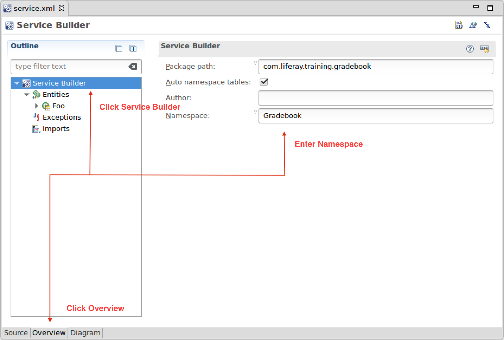
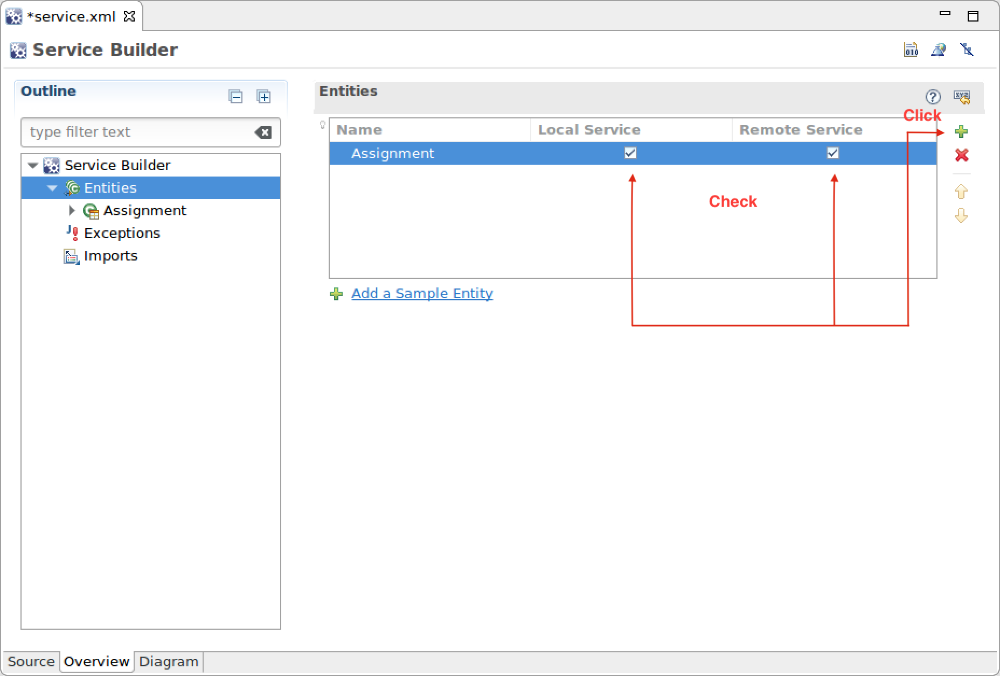
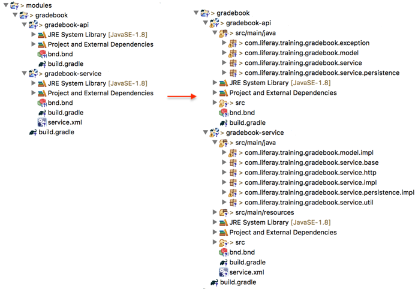

Create the Assignment Service
====
> #### Exercise Goals
> - Create a Liferay Service Builder Project using the service-builder template
> - Define the Assignment entity
> - Define service exceptions
> - Final code review
> - Build the service

####Create a Liferay Service Builder Project
#####Option 1: Use the Command Line Blade tools

1. pen the Command Line shell in your Liferay Workspace modules folder.
2. Run command:
    ```
    blade create -t service-builder -v 7.2 -p com.liferay.training.gradebook gradebook
    ```
3. Run Gradle refresh on the IDE.

#####Option 2: Use the Developer Studio Wizard

1. Launch the Liferay Module Project wizard in Developer Studio.
2. Use the following information for the first step:
    - Project Name: "gradebook"
    - Build Type: Gradle
    - Liferay Version: 7.2
    - Project Template: service-builder
3. Click Next and use the following information in the second step:
    - Package Name: "com.liferay.training.gradebook"
4. Click Finish to close the wizard.

__________
#####Define the Assignment Entity
`service.xml` is the main configuration file of a Service Builder project. It lets you define model entities, data sources, finder methods, and exceptions for your service.

You can customize `service.xml` with a graphical designer tool or edit the file's source code directly. We'll help you become familiar with both approaches.

First, define the **namespace** for our service. The namespace is used for prefixing the database tables Service Builder generates for the service:

1. Open the `service.xml` file in the gradebook-service folder.
2. Click on the Overview view.
3. Click Service Builder in the outline tree.
4. Enter "Gradebook" in the Namespace.

#####Delete the Example Entity
Delete the dummy entity created by the template. We don't need that for this exercise:

1. Right-click on the Foo entity in the outline tree and delete the entity.

#####Create the Assignment Entity
1. Click the green plus icon on the right side of the entities list to add a new entity.
2. Enter "Assignment" for the Name field.
3. Check both the Local Service and the Remote Service.


#####Define Assignment Columns
Define Assignment fields, which map to database model columns.

1. Double-click on the Assignment entity in the outline tree to open entity properties.
2. Click on the Columns.
4. Click Add Default Columns to add a default set of fields.

>Take a look at the columns created. You'll see that a default primary key for the entity, assignmentId, was created automatically.

Let's add the title column:

1. Click the green plus sign on the right side of the columns list to add a new column.
2. Enter "title".
3. Double-click the Type column.
4. Click the browse icon on the right side of the field and select String type.
Let's now have a look at editing the `service.xml` in source mode instead of using the graphical designer.

Make the title field localizable:

>Notice that you can use IDE's code-completion feature while editing the `service.xml` in source mode:

1. Click on the Source tab in the designer.
2. Add the localized="true" attribute for the title field.
    - The title field definition will now look like this:
    ```xml
    <column name="title" type="String" localized="true" />
    ```
3. Add the rest of the Assignment's columns after the title column:
    ```xml
    <column name="description" type="String" localized="true" />
    <column name="dueDate" type="Date" />
    ```
   
#####Define the Default Sort Order
Define the default sort order for Assignment entities:

1. Add the following snippet after the column definitions:
    ```xml
    <!-- Order -->

    <order by="asc">
        <order-column name="title" />
    </order>
    ```
#####Define the Finder Methods
Finders are methods for querying entities by columns. For now, we'll just need to be able to find items by groupId:

1. Add the following snippet after the order definition:
    ```xml
     <!-- Finders -->
    
     <!-- Find by groupId -->
    
     <finder name="GroupId" return-type="Collection">
         <finder-column name="groupId"/>
     </finder>
    ```

#####Define the Entity References

References define entity services injected in our service classes. This helps to keep the database calls inside a single transaction.

We need the Group services and Liferay Asset services for integrating to the Liferay Asset framework for later exercise steps.

1. Add the following reference definitions after the finder definitions:

   ```xml
    <!-- Reference to Group entity service -->
    
     <reference entity="Group" package-path="com.liferay.portal"/>
    
     <!-- Entity services needed for the integration to Asset framework -->
    
     <reference entity="AssetEntry" package-path="com.liferay.portlet.asset"/>
     <reference entity="AssetLink" package-path="com.liferay.portlet.asset"/>
     <reference entity="AssetTag" package-path="com.liferay.portlet.asset"/>
    ```
   
#####Define the Service Exceptions
Define an exception for validation purposes:

1. Add the following code snippet after the closing tag of entity:
    ```xml
     <exceptions>
         <exception>AssignmentValidation</exception>
     </exceptions>
    ```
   
#####Final Code Review

Use IDE's automatic code formatting to fix indents and spacing. The final `service.xml` will look like this:
```xml
<?xml version="1.0"?>
<!DOCTYPE service-builder PUBLIC "-//Liferay//DTD Service Builder 7.2.0//EN" "http://www.liferay.com/dtd/liferay-service-builder_7_2_0.dtd">

<service-builder dependency-injector="ds" package-path="com.liferay.training.gradebook">
    <namespace>Gradebook</namespace>

    <entity local-service="true" name="Assignment" remote-service="true" uuid="true">

        <!-- PK fields -->

        <column name="assignmentId" primary="true" type="long"/>

        <!-- Group instance -->

        <column name="groupId" type="long"/>

        <!-- Audit fields -->

        <column name="companyId" type="long"/>
        <column name="userId" type="long"/>
        <column name="userName" type="String"/>
        <column name="createDate" type="Date"/>
        <column name="modifiedDate" type="Date"/>
        <column name="title" type="String" localized="true"/>

        <column name="description" type="String" localized="true" />
        <column name="dueDate" type="Date" />

        <!-- Order -->

        <order by="asc">
            <order-column name="title" />
        </order>

        <!-- Finders -->

        <!-- Find by groupId -->

        <finder name="GroupId" return-type="Collection">
            <finder-column name="groupId"/>
        </finder>

        <!-- Reference to Group entity service -->

        <reference entity="Group" package-path="com.liferay.portal"/>

        <!-- Entity services needed for the integration to Asset framework -->

        <reference entity="AssetEntry" package-path="com.liferay.portlet.asset"/>
        <reference entity="AssetLink" package-path="com.liferay.portlet.asset"/>
        <reference entity="AssetTag" package-path="com.liferay.portlet.asset"/>
    </entity>

    <!-- Exceptions -->

    <exceptions>
        <exception>AssignmentValidation</exception>
    </exceptions>
</service-builder>
```
#####Build the Service
There's only one step left: to build the service and generate service classes. When you run the `buildService` Gradle task, the following items are generated:

1. Database schema for the service (committed at module deploy time)
2. Persistence and caching
3. Local and remote service APIs
> Remember that you have to rebuild services whenever you edit the `service.xml`.

Run the buildService Gradle task:

1. **Expand** the `training-workspace/modules/gradebook/build` in the Gradle Tasks panel.
2. **Execute** the `buildService` task.

The Assignment services have now been generated, and your project tree will look like this:


> Notice that you can run the service generation task from several places:
>
> - Using the project's `buildService` task on the Gradle Tasks panel
> - The Overview panel of the `service.xml` designer
> - The Context menu of the *gradebook-service* project
> - From the *Command Line* using the Liferay Workspace `gradlew` script

#####Add Missing Dependencies
The autogenerated classes depend on packages, which aren't included in the service module's default dependency configuration.

1. Configure the dependencies in the service module's `build.gradle` file as follows:
    ```gradle
    dependencies {
        compileOnly group: "com.liferay", name: "com.liferay.petra.lang"
        compileOnly group: "com.liferay", name: "com.liferay.petra.string"
        compileOnly group: "com.liferay", name: "com.liferay.portal.aop.api"
        compileOnly group: "com.liferay.portal", name: "com.liferay.portal.kernel"
        compileOnly group: "org.osgi", name: "org.osgi.annotation.versioning"
        compileOnly group: "org.osgi", name: "org.osgi.core"
        compileOnly group: "org.osgi", name: "org.osgi.service.component.annotations"
        compileOnly project(":modules:gradebook:gradebook-api")
    }
    
    buildService {
        apiDir = "../gradebook-api/src/main/java"
    }
    
    group = "com.liferay.training.gradebook"
    ```